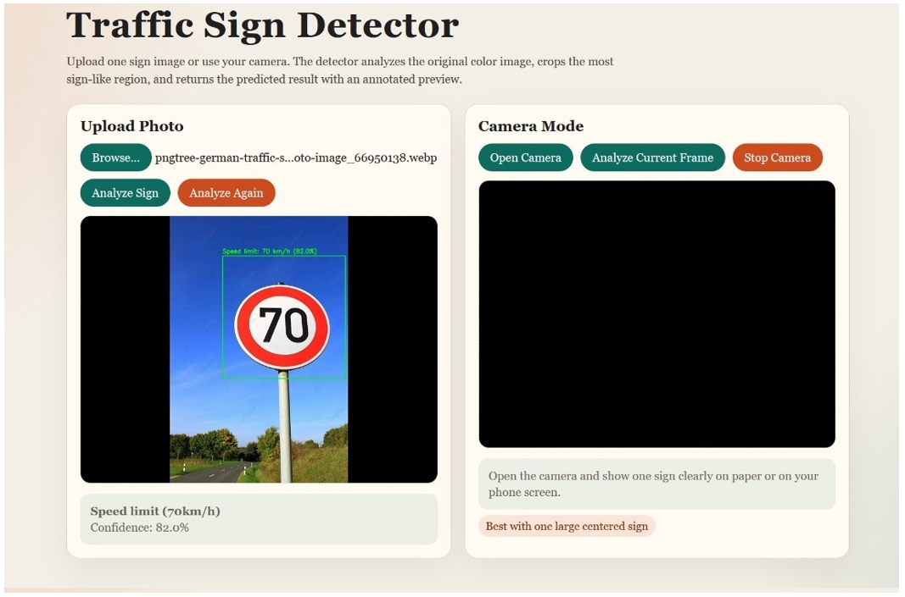
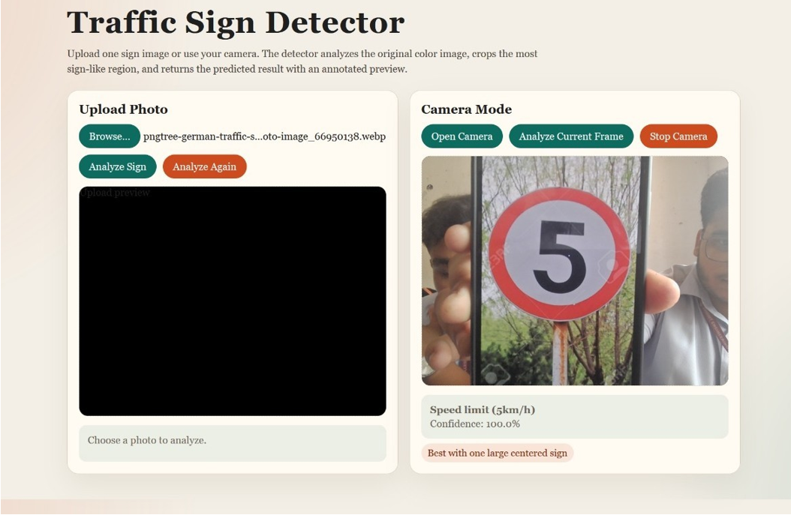

# Real-Time Traffic Sign Board Detection

This project is a real-time traffic sign detection and classification system built using Python, OpenCV, TensorFlow/Keras, and Deep Learning. The project can detect traffic signs from webcam input as well as uploaded images and classify them using a trained CNN model.

I built this project mainly to learn more about Computer Vision, Deep Learning, image preprocessing, and real-time detection systems.

---

## Features

- Real-time traffic sign detection using webcam
- Traffic sign classification using Deep Learning
- Image upload support
- Speed limit sign recognition
- Region of interest detection using contour detection
- Confidence-based prediction filtering
- Simple web interface for testing

---

## Technologies Used

- Python
- OpenCV
- TensorFlow / Keras
- MobileNetV2
- NumPy
- Pandas
- Flask / Python Web Interface
- Google Colab

---

## Project Screenshots

### Image Upload Detection



### Webcam Detection



---

## Background

The main aim of this project was to create a system that can detect and classify traffic signs in real time using Deep Learning and Computer Vision techniques.

The project uses OpenCV for preprocessing and sign detection while TensorFlow/Keras is used for training the CNN model. The final system can work with both uploaded images and webcam input through a simple web interface.

---

## How It Works

1. The image is captured from webcam or uploaded through the website.
2. OpenCV is used for:
   - image resizing
   - color masking
   - contour detection
   - region of interest extraction
3. The detected sign region is passed into the trained CNN model.
4. The model predicts the traffic sign class with confidence score.
5. The final result is displayed on the website.

---

## Model Information

- Model Type: CNN with Transfer Learning
- Base Model: MobileNetV2
- Framework: TensorFlow/Keras
- Accuracy: 90%+
- Training Platform: Google Colab

---

## Challenges Faced

The hardest part of this project was detecting the digits inside speed limit signs correctly. Sometimes blur, reflections, tilted signs, lighting conditions, and low-quality images caused wrong predictions.

To improve the results, I used:
- contour detection
- confidence filtering
- color masking
- preprocessing techniques
- region based sign extraction

This helped improve the detection accuracy and reduce false predictions.

---

## Installation

Clone the repository:

```bash
git clone https://github.com/abhinav4001/realtime-traffic-sign-board-detection.git
cd realtime-traffic-sign-board-detection
```

Install dependencies:

```bash
pip install opencv-python tensorflow flask numpy pandas
```

Run the project:

```bash
python web_app.py
```

---

## Project Structure

```bash
.
├── traffic_detection.py
├── realtime_camera_detection.py
├── web_app.py
├── colab_train_traffic_signs.py
├── traffic_sign_model.keras
├── labels.csv
├── class_order.json
├── .gitignore
└── README.md
```

---

## References

- GeeksforGeeks Traffic Sign Recognition using CNN and Keras  
  https://www.geeksforgeeks.org/deep-learning/traffic-signs-recognition-using-cnn-and-keras-in-python/

- TensorFlow Documentation  
  https://www.tensorflow.org/

- OpenCV Documentation  
  https://opencv.org/

---

## Future Improvements

- Improve detection accuracy
- Add YOLO-based object detection
- Deploy the project online
- Support more traffic sign categories
- Improve real-time performance

---

## Author

Abhinav PS

GitHub: https://github.com/abhinav4001
